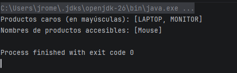
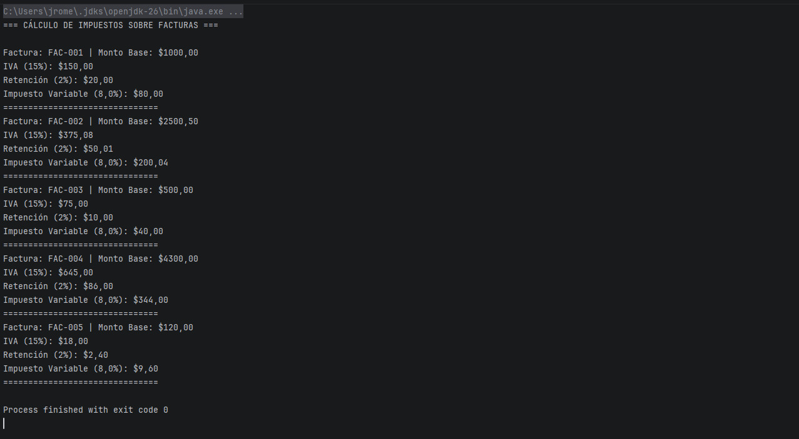
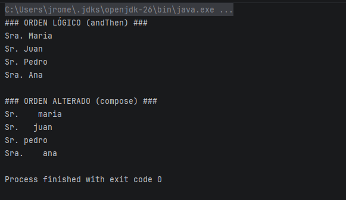

# Como ejecutar el programa
 Para realizar esto unicamente toca dirigirnos en nuestro editor de codigo 
 de preferencia que sea de java para su compilación donde debemos abrir los archivos de las
 actividades una vez con los archivos se debera ejecutar / compilar.
 
Una vez compilado este mostrara por consola los resultados.

## Version de java usado

Para esta actividad se uso java 17 el cual se aplico desde spring inizilizer

# Capturas de la ejecución

## Actividad 2

## Actividad 3

## Actividad 4

